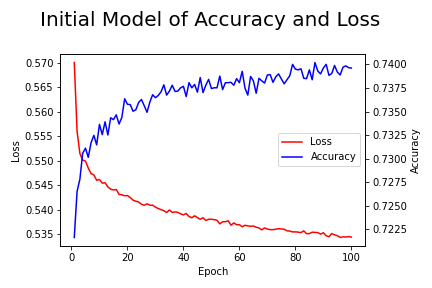
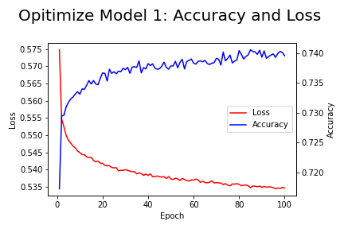

# Deep Learning: Charity Funding Predictor

#### Note: Created with Google Colab. Do not run the first section of code if you are not using google colab to mount the drive. Additionally, you would need to change the file path names throughout. 

## Background

The non-profit foundation Alphabet Soup wants to create an algorithm to predict whether or not applicants for funding will be successful. With your knowledge of machine learning and neural networks, you’ll use the features in the provided dataset to create a binary classifier that is capable of predicting whether applicants will be successful if funded by Alphabet Soup.

From Alphabet Soup’s business team, you have received a CSV containing more than 34,000 organizations that have received funding from Alphabet Soup over the years. Within this dataset are a number of columns that capture metadata about each organization, such as the following:

## File Path Setup:
- google colab folder (or one of your choice to change in the code) 
- **/content/drive/MyDrive/Colab Notebooks/**
**Deep-Learning** (folder to keep the Jupyter Notebook code files)
- In **Deep-Learning**  -> **Resources**   (file for data)
- In **Deep-Learning**  -> **Images**      (output images)
- In **Deep-Learning**  -> **Models**      (output models created)
- In **Deep-Learning**  -> **checkpoints** (output of model checkpoints, overwritten when another models is run)

## Instructions

### Step 1: Preprocess the data

Using your knowledge of Pandas and the Scikit-Learn’s `StandardScaler()`, you’ll need to preprocess the dataset in order to compile, train, and evaluate the neural network model later in Step 2

Using the information provided in the starter code, follow the instructions to complete the preprocessing steps.

1. Read in the charity_data.csv to a Pandas DataFrame, and be sure to identify the following in your dataset:
  * What variable(s) are considered the target(s) for your model?
  * What variable(s) are considered the feature(s) for your model?

- EIN and NAME—Identification columns
- APPLICATION_TYPE—Alphabet Soup application type
- AFFILIATION—Affiliated sector of industry
- CLASSIFICATION—Government organization classification
- USE_CASE—Use case for funding
- ORGANIZATION—Organization type
- STATUS—Active status
- INCOME_AMT—Income classification
- SPECIAL_CONSIDERATIONS—Special consideration for application
- ASK_AMT—Funding amount requested
- IS_SUCCESSFUL—Was the money used effectively

2. Drop the `EIN` and `NAME` columns.
3. Determine the number of unique values for each column.
4. For those columns that have more than 10 unique values, determine the number of data points for each unique value.
6. Use the number of data points for each unique value to pick a cutoff point to bin "rare" categorical variables together in a new value, `Other`, and then check if the binning was successful.
7. Use `pd.get_dummies()` to encode categorical variables

### Step 2: Compile, Train, and Evaluate the Model

Using your knowledge of TensorFlow, you’ll design a neural network, or deep learning model, to create a binary classification model that can predict if an Alphabet Soup–funded organization will be successful based on the features in the dataset. You’ll need to think about how many inputs there are before determining the number of neurons and layers in your model. Once you’ve completed that step, you’ll compile, train, and evaluate your binary classification model to calculate the model’s loss and accuracy.

1. Continue using the jupter notebook where you’ve already performed the preprocessing steps from Step 1.
2. Create a neural network model by assigning the number of input features and nodes for each layer using Tensorflow Keras.
3. Create the first hidden layer and choose an appropriate activation function.
4. If necessary, add a second hidden layer with an appropriate activation function.
5. Create an output layer with an appropriate activation function.
6. Check the structure of the model.
7. Compile and train the model.
8. Create a callback that saves the model's weights every 5 epochs.
9. Evaluate the model using the test data to determine the loss and accuracy.
10. Save and export the results to an HDF5 file, and name it `AlphabetSoupCharity.h5`.

### Step 3: Optimize the Model

Using your knowledge of TensorFlow, optimize your model in order to achieve a target predictive accuracy higher than 75%. If you can't achieve an accuracy higher than 75%, you'll need to make at least three attempts to do so.

Optimize your model in order to achieve a target predictive accuracy higher than 75% by using any or all of the following:

* Adjusting the input data to ensure that there are no variables or outliers that are causing confusion in the model, such as:
  * Dropping more or fewer columns.
  * Creating more bins for rare occurrences in columns.
  * Increasing or decreasing the number of values for each bin.
* Adding more neurons to a hidden layer.
* Adding more hidden layers.
* Using different activation functions for the hidden layers.
* Adding or reducing the number of epochs to the training regimen.

1. Create a new Jupyter Notebook file and name it `AlphabetSoupCharity_Optimzation.ipynb`.
2. Import your dependencies, and read in the `charity_data.csv` to a Pandas DataFrame.
3. Preprocess the dataset like you did in Step 1, taking into account any modifications to optimize the model.
4. Design a neural network model, taking into account any modifications that will optimize the model to achieve higher than 75% accuracy.
5. Save and export your results to an HDF5 file, and name it `AlphabetSoupCharity_Optimization.h5`.

### Step 4: Written Report on the Neural Network Model

Written report on the performance of the deep learning model created for AlphabetSoup.

**OVERVIEW** of the analysis:
#### Deep Learning Project; Chartiy Funding Predictor for Alphabet Soup.
Deep learning and neural networks were used to determine if applicants for funding would be successfull. 
The csv file with 34299 rows and 12 columns was submitted for review.

# **RESULTS**

## Data Preprocessing
**The target variables in the model**
* **IS_SUCCESSFUL**—Was the money used effectively
The value of '1' is considered 'yes' (successful) and '0' is considered 'no' (unsuccessful)

**The initial dropped values**
* **EIN** and **NAME**—Identification columns
* These values were removed from the 'starter_model'. The 'EIN' column is a unique number. 
* Note: The 'NAME' column is initially set to be dropped as requested, as irrelevant. In the third optimization attempt, the 'NAME' was added as a feature to this model.

**Feature variables in the model**
* **APPLICATION_TYPE**—Alphabet Soup application type
* **AFFILIATION**—Affiliated sector of industry
* **CLASSIFICATION**—Government organization classification
* **USE_CASE**—Use case for funding
* **ORGANIZATION**—Organization type
* **STATUS**—Active status
* **INCOME_AMT**—Income classification
* **SPECIAL_CONSIDERATIONS**—Special consideration for application
* **ASK_AMT**—Funding amount requested
The above remaining variables (columns) are considered features.

**CLASSIFICATION** and **APPLICATION_TYPE** were replaced with **Other** 
Encoding of categorical variables, using sklearn.preprocessing.OneHotEncoder, after bucketing noisy features 'APPLICATION_TYPE' and 'CLASSIFICATION' with many unique values. After one hot encoding, the data was split into the 'target' and 'features', split further into 'training' and 'testing' sets, and a scaler was used on the training and testing data using sklearn.preprocessing.StandardScaler.
        
    
## Compiling, Training, and Evaluating the Model
* How many neurons, layers, and activation functions did you select for your neural network model, and why?

### **Starter Code**
Initially a Sequential model with dense layers. Input layer, then two hidden layers with 80 and 30 neurons each using a 'relu' activation function. One 'sigmoid' activation function with one neuron. There were 5,981 trainable parameters.

The number of neurons, layers are pictured below.

    
The model performance as seen in the chart below of the training data:

    
The accuracy graph above, of the training data, shows that the model can be trained a little more. The accuracy plot shows a steady rise with some ups and down due to training. The accuracy is still rising and falling a little bit in the last few epochs. Thus, a better accuracy could be attempted. The training accuracy looks to be near 74%. The loss looks like it is just about to level out, but it took some time to do so because there is a gentle, long downward curve. The training loss looks to be around 53.5%

**Testing Scores**
Attempting to reach a 75% accuracy.
- Loss: 0.5624013543128967, Accuracy: 0.7273469567298889

The testing data for the starter code has reached a 72.73% testing accuracy and a loss of 56.24%

**ATTEMPTS TO OPTIMIZE THE MODEL:**
Batches were used for these models, and checkpoints were saved. (overwritten though)

### **First Optimization Attempt**  
The first attempt at increasing the accuracy, was to change some of the hyperparameters. 
By adding one more layer with another 'relu' activation function, there are more interactions between the variables. This may increase the accuracy. The con to this is additional computational reasources. Thus, input layer, then three hidden layers with 80, 30, and 10 neurons each using a 'relu' activation function. One 'sigmoid' activation function with one neuron. There are now 6,271 trainable parameters.

The below image shows the changes to the model with respect to neurons, layers.

The model performance as seen in the chart below with the training data:

The accuracy graph above, of the training data, shows that the model looks almost completely trained by the end of the 100 epochs. (The accuracy line looks to just be levelling out.) The accuracy plot shows a steady rise with some ups and down due to training. The training accuracy looks to be near 74%. The loss looks like it has levelled out around 100 epochs. The training loss looks to be around 53.5% A few more epochs may be needed to see if the training data is levelling out here.

**Testing Scores**
- Loss: 0.5624170303344727, Accuracy: 0.7297959327697754

The scores showed that the accuracy rate with the test data went up a slight amount to 72.98% and the loss had a slight increase of 56.242% 

### **Second Optimization Attempt**  
The second attempt at increasing the accuracy, was to keep the 3 hidden layers, but to increase the number of neurons. Additionally, use the activation functions 'Sigmoid' a few more times. Sigmoid was used because there is a binary output and a Sigmoid function creates this binary 0/1 output calculation. Thus, input layer, then three hidden layers with 180 (relu), 50 (sigmoid), and 10 neurons (sigmoid). Another 'sigmoid' activation function with one neuron. There are now 17,491 trainable parameters. 

The below image shows the changes to the model with respect to neurons, and layers.

    
The model performance as seen in the chart below with the training data:

    
As a result the speed was compromised (additionaly training with more neurons). The accuracy graph above, of the training data, shows that the model looks completely trained by the end of the 100 epochs. The accuracy plot shows a steady rise with some ups and down due to training. The training accuracy looks to be near 74%. The loss looks like it has levelled out around 100 epochs. The training loss looks to be around 53% 

**Testing Scores**
- Loss: 0.5611435174942017, Accuracy: 0.7271137237548828 

The scores showed that the accuracy rate went down a slight amount to 72.71% and the loss had a slight increase of 56.11% . (Various numbers and layers were attempted, but the accuracy did not increase much after this. At times this optimized better than the first optimization attempt.)

#### Third Optimization Attempt  
The third attempt at increasing the accuracy, was to add additional features. The 'NAME' was earlier removed from the dataset. The 'NAME' densities that are <5 were grouped together in an 'other' category. Again, all object data used one hot encoding. Thus, input layer, then three hidden layers with 180 (relu), 50 (sigmoid), and 10 neurons (sigmoid). Another 'sigmoid' activation function with one neuron. With additional features, there are now 90,031 trainable parameters. More data may increase the accuracy.

The below image shows the model with respect to neurons, and layers.

    
The model performance on the training model as seen in the chart below:

As a result the speed was compromised.  The accuracy graph above, of the training data, shows that the model looks completely trained by the end of the 100 epochs. The accuracy plot shows a steady rise with some ups and down due to training. The training accuracy looks to be near 81%. The loss looks like it has levelled out around 100 epochs. The training loss looks to be around 35% 

**Testing Scores**
- Loss: 0.4726506471633911, Accuracy: 0.78950434923172

The scores showed that the accuracy rate went up to 78.95% and the loss had a decrease of 47.27% . Model performance increased and the target of >=75% accuracy was reached.
    
Although, the accuracy may be valid with testing criteria in the dataset, a new dataset to test this model on may give poorer results. The NAMES category, are businesses, whom reaply and have had previous success in receiving a loan. Thus, the model may have a bias introduced this way. 

 # **Summary**

The first two optimization models were unable to perform a 75% accuracy rate. Attempts were initially made to increase the layers with 10 additional neurons in it, a second attempt was to additionally use the Sigmoid function in some of the hidden layers and increasing the number of neurons. Testing accuracy was shown to be around the same. 
Starter : 72.73%
Optimize 1: 72.98%
Optimize 2: 72.71%

The last model, may have introduced a bias by using the 'NAME' classisfication, but was able to attain a 78.95% accuracy rate with the testing data. Further testing with seperate data would need to be done to prove whether a bias of using the 'NAME' classification was introduced. Although, it makes sense that if a 'company' was approved for a loan, the 'company' would further reapply and be approved for more loans. 

Note that the optimization models only increased the testing accuracy slightly. This can be compared to some of 'con' characteristics of the binary classifier as listed here and below: [Pros and Cons of Activation Functions]( https://ml-cheatsheet.readthedocs.io/en/latest/activation_functions.html)

**Cons of Sigmoid**

- Towards either end of the sigmoid function, the Y values tend to respond very less to changes in X.
- It gives rise to a problem of “vanishing gradients”.
- Its output isn’t zero centered. It makes the gradient updates go too far in different directions. 0 < output < 1, and it makes optimization harder.
- Sigmoids saturate and kill gradients.
- The network refuses to learn further or is drastically slow ( depending on use case and until gradient /computation gets hit by floating point value limits ).

**Improving the Model More**
- Seperate test data is needed to test the successful model. If the model proves to work, more can be done to improve the speed. Fewer batches could be created according to the data size. One may be able to get a similar accuracy with fewer neurons as well. 
- It takes a while for some of the 'NAMES' to be placed in the 'Other' category optimization of code could be done here.
- A review of some of the error amounts could be done for insights.

- - -

___
© 2021 SherryK. All Rights Reserved.	
